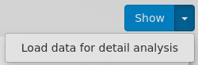

### Status
[](https://travis-ci.org/iteratec/OpenSpeedMonitor)

# OsmDetailAnalysis (DA)
Microservice that provides an interactive dashboard to analyze web performance waterfall data.

It can be integrated with [OpenSpeedMonitor](https://github.com/iteratec/OpenSpeedMonitor). A demo instance is available [here](https://demo.openspeedmonitor.org/detailAnalysis/show).

Compatibility with OpenSpeedMonitor:

| Version OpenSpeedMonitor  | Compatible version OsmDetailAnalysis |
| ------------------------- |:------------------------------------:|
| 4.1.1                     | 1.0                                  |
| \>=4.1.2                  | 1.2.X                                |


Setup and integration with OpenSpeedMonitor
---
The DetailAnalysis (DA) is designed to run next to one or more existing OpenSpeedMonitor instance(s) and is not able run as a standalone application.
To connect both Applications, you need to edit their configurations:

As for OpenSpeedMonitor, the configuration file for the DA should be located in `~/.grails/OsmDetailAnalysis-config.yml`. A sample file can be found in `grails-app/conf/OsmDetailAnalysis-config.yml.sample`.

Configure an API key in this file under the key `grails.de.iteratec.osm.da.apiKeys`. The URL has to match with the one which is used by your OpenSpeedMonitor instance, which you want to connect.

For a local installation:
```
apiKeys:
 list:
    - key: aKeyLongerThanThis
      osmUrl: "http://localhost:8080"
 ```
 Note that one DA Instance can be used by multiple OSM Instances. Just add more keys.
 At startup of the DA, all keys in the database will be synchronized with this config file, while the config file is the single source of truth.
 
 Next you should update your OSM configuration, typically located in ``~/.grails/OpenSpeedMonitor-config.yml``:
 ````
environments:
     development:
       grails:
         de.iteratec.osm.detailAnalysis:
           enablePersistenceOfDetailAnalysisData: true
           microserviceUrl: http://localhost:8081
           apiKey: aKeyLongerThanthis
````
Note again, that the URL has to match your DA Url. If you want to run this setup in production, do the same thing for `environments.productions...`.

Now everything you need is a running MongoDB instance. Currently we support version 3.2. 
````
mkdir mongodbdata
docker run -p 27017:27017 -v mongodbdata:/data/db mongo:3.2
````

Now start both applications:
```
cd OpenSpeedMonitor
./gradlew bootRun
cd ../OsmDetailAnalysis
./gradlew bootRun
```

You may use [docker-compose file](https://github.com/iteratec/OpenSpeedMonitor/blob/develop/docker/docker-compose.yml) to run OSM and DA in docker containers for production.

The persistence of detail data can be configured in OpenSpeedMonitor. The persistence will be enabled per JobGroup. Login and navigate to ``http://localhost:8080/jobGroup/index``, click on the job group and set `Persist DetailData` to `true`.
Now every time you get a new result, the DA will be informed and will fetch all detail data for later analysis.

To show your data, navigate to ``https://osm.otto.iteratec.de/detailAnalysis/show``, set the filter and click on show. Note that you will only see data, since the Job Group was configured to persist detail data. If you want to load data before that you may use the extended button (you have to be logged in to see this option in the gui):



Note that the process of downloading old data takes some time. So depending on the amount this could take minutes to hours. A batch job will be created, where you can see the current progress.

Now you should be able to see something like this:


The data loaded and shown in the DA dashboard can be filtered interactively in the UI.

Storage
---

The amount of data needed for the detail analysis can easily reach multiple GB, depending on your number measurement jobs and their frequency.
Therefore the default configuration will delete data older then 60 days from DA database. To change that, just edit the configuration file
```
grails:
    ...
    de:
      iteratec:
        osm:
          da:
            cleanup:
              daysToKeep: 60
 ```
No matter how long the DA will persist the data per default, you may always post load older data, as long as your wpt server still has all the data needed.

Performing a Release
---

Releases are automated by [Travis CI](https://travis-ci.org/iteratec/OsmDetailAnalysis).

To create a release update the version in `build.gradle`, commit it and create a tag with the same version:

    $ git add build.gradle
    $ git commit -m "Release 1.2.3"
    $ git tag v1.2.3
    $ git push --tags
    $ git push

Travis will then build the project, release it to github and push to docker.
